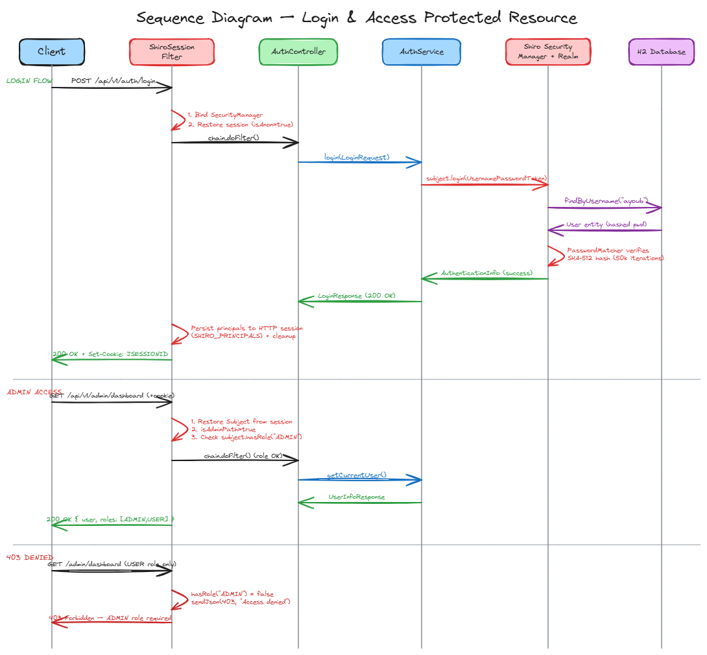

# Apache Shiro Security App — Spring Boot 3.x

A demonstration of integrating **Apache Shiro 2.1.0** with **Spring Boot 3.x (Jakarta EE 9)** for session-based authentication and role-based authorization.

## Why Apache Shiro?

| | Spring Security | Apache Shiro |
|---|---|---|
| **Learning curve** | Steep — complex filter chain, many abstractions | Gentle — intuitive Subject/Realm API |
| **Standalone use** | Tightly coupled to Spring | Works without any framework |
| **Session management** | Delegates to servlet container | Built-in session management |
| **Annotations** | `@PreAuthorize`, `@Secured` | `@RequiresRoles`, `@RequiresPermissions` |
| **Best for** | Large Spring ecosystems | Simpler/non-Spring apps |

> See: [Spring Security vs Apache Shiro — StackOverflow](https://stackoverflow.com/questions/11500646/spring-security-vs-apache-shiro)
> Official docs: [Apache Shiro Spring-Boot Integration](https://shiro.apache.org/spring-boot.html)

## Technology Stack

| Technology | Version | Role |
|---|---|---|
| Java | 17 | Language |
| Spring Boot | 3.5.x | Framework |
| Apache Shiro | 2.1.0 | Security (auth/authz) |
| Spring Data JPA | — | Data access |
| H2 | — | In-memory database (dev) |
| Jakarta Validation | — | DTO validation |
| SpringDoc OpenAPI | 2.8.6 | Swagger UI |

## Architecture



## Key Design Decision: No `shiro-web`

`shiro-web` 2.1.0 still uses `javax.servlet.Filter`, which is **binary incompatible** with Spring Boot 3.x (`jakarta.servlet`). The solution:

```
shiro-spring-boot-web-starter  ✗  removed (uses javax.servlet)
shiro-web                      ✗  removed (uses javax.servlet)
─────────────────────────────────────────────────────
shiro-core                     ✓  SecurityManager, Subject, Realm
shiro-spring                   ✓  LifecycleBeanPostProcessor, AOP advisor
ShiroSessionFilter             ✓  Custom OncePerRequestFilter (jakarta)
```

`ShiroSessionFilter` replaces `AbstractShiroFilter`. It:
1. Creates the HTTP session before the request is processed
2. Restores `PrincipalCollection` from `HttpSession` to rebuild `Subject`
3. Enforces URL rules (anon / authc / admin)
4. After the request, persists auth state back to `HttpSession`
5. Cleans up `ThreadContext` (always, even on error)

## Password Security

Passwords are hashed using Shiro 2.x `DefaultPasswordService`:

- **Algorithm**: SHA-512
- **Iterations**: 50,000
- **Salt**: random per-user, auto-generated
- **Format**: `$shiro2$SHA-512$50000$<salt>$<hash>`

This replaces the previous single-iteration SHA-256 approach which was vulnerable to brute-force attacks.

## Getting Started

### Prerequisites

- Java 17+
- Maven 3.8+

### Run

```bash
mvn spring-boot:run
```

The app starts on **http://localhost:8080** (or the port configured in `application.properties`).

### Seeded Users

| Username | Password | Roles |
|----------|---|---|
| `admin`  | `admin123` | ADMIN, USER |
| `ayoub`    | `ayoub123` | USER |

### Useful URLs

| URL | Description |
|---|---|
| http://localhost:8080/swagger-ui.html | Swagger UI |
| http://localhost:8080/v3/api-docs | OpenAPI JSON |
| http://localhost:8080/h2-console | H2 Database Console |

H2 Console credentials: JDBC URL `jdbc:h2:mem:shiro_db`, username `sa`, no password.

## API Endpoints

### Public (no auth required)

| Method | Path | Description |
|---|---|---|
| `GET` | `/api/v1/hello` | Health check |

### Authentication

| Method | Path | Body | Description |
|---|---|---|---|
| `POST` | `/api/v1/auth/login` | `{"username":"…","password":"…"}` | Login |
| `POST` | `/api/v1/auth/logout` | — | Logout |
| `GET` | `/api/v1/auth/me` | — | Current user info (requires auth) |

### Admin (requires ADMIN role)

| Method | Path | Description |
|---|---|---|
| `GET` | `/api/v1/admin/dashboard` | Admin dashboard |

## Example Requests

**Login:**
```bash
curl -c cookies.txt -H "Content-Type: application/json" \
  -d '{"username":"admin","password":"admin123"}' \
  http://localhost:8080/api/v1/auth/login
```
```json
{"message":"Login successful","username":"admin","isAdmin":true,"roles":["ADMIN","USER"]}
```

**Get current user (with session cookie):**
```bash
curl -b cookies.txt http://localhost:8080/api/v1/auth/me
```
```json
{"username":"admin","isAdmin":true,"isUser":true,"roles":["ADMIN","USER"]}
```

**Validation error (empty body):**
```bash
curl -H "Content-Type: application/json" -d '{}' http://localhost:8080/api/v1/auth/login
```
```json
{"status":400,"error":"Bad Request","message":"Validation failed","fieldErrors":{"username":"Username is required","password":"Password is required"}}
```

**Unauthorized (no session):**
```json
{"error":"Not authenticated — POST /api/v1/auth/login first"}
```

**Forbidden (wrong role):**
```json
{"error":"Access denied — ADMIN role required"}
```

## Testing

### Run all tests

```bash
mvn test
```

### Test Summary (26 tests)

| Test Class | Tests | Type |
|---|---|---|
| `AuthServiceImplTest` | 8 | Unit — mocked Shiro Subject |
| `ShiroSessionFilterTest` | 7 | Unit — real SecurityManager, mock servlet |
| `AuthIntegrationTest` | 10 | Integration — full Spring context + MockMvc |

**Unit tests** verify:
- Login success, already-authenticated, unknown user, wrong password
- Logout, getCurrentUser (authenticated and unauthenticated)
- Filter anon paths (hello, login, swagger), protected paths (401), admin paths (403)
- ThreadContext cleanup after each request
- JSON response validity via ObjectMapper

**Integration tests** verify:
- Public endpoints accessible without auth
- Login validation (empty body, wrong password, unknown user)
- Full admin flow: login → me → admin dashboard → logout → re-access fails
- Regular user flow: login → me → admin dashboard returns 403

## Sources

- [Spring Security vs Apache Shiro — StackOverflow](https://stackoverflow.com/questions/11500646/spring-security-vs-apache-shiro)
- [Apache Shiro Spring-Boot Integration — Official Docs](https://shiro.apache.org/spring-boot.html)
