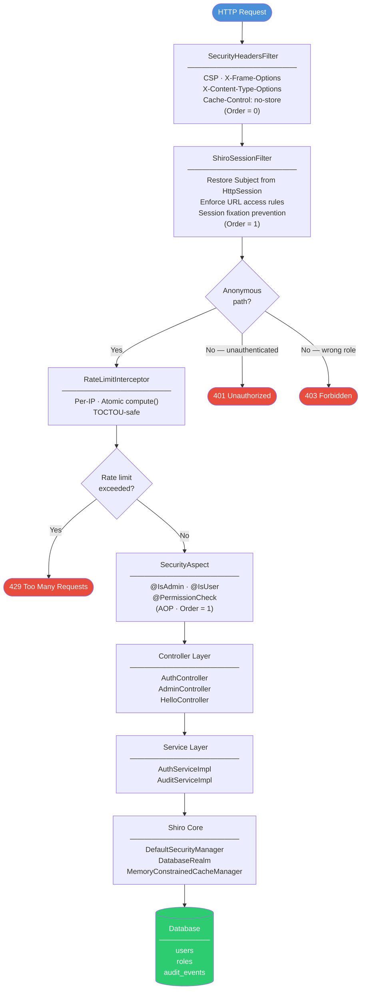
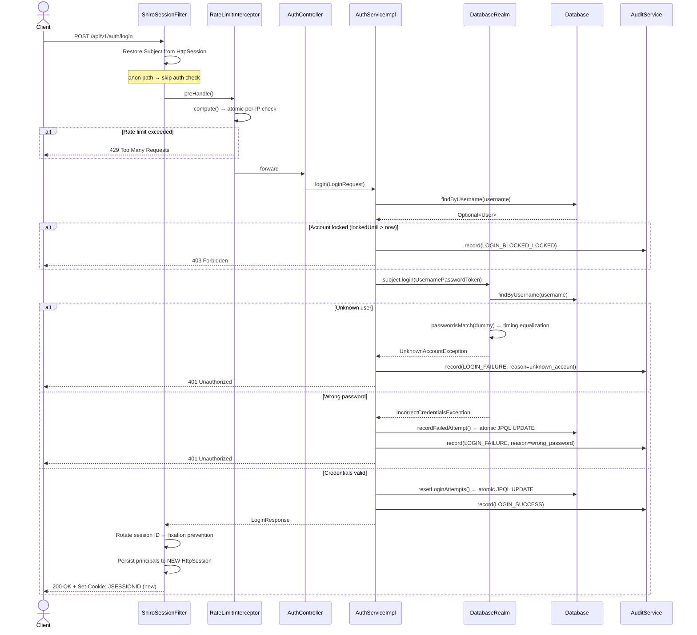
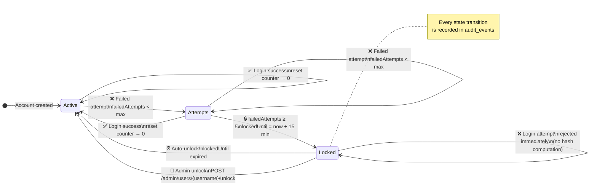
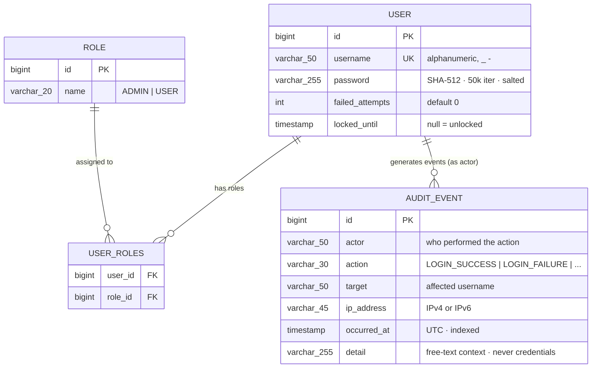

# 🔐 Apache Shiro Security App — Spring Boot 3.x

<p align="center">
  
  
  
  
  
</p>

> A **production-hardened** demonstration of integrating Apache Shiro 2.1.0 with Spring Boot 3.x (Jakarta EE 9)
> for session-based authentication, role-based authorization, account lockout, rate limiting, audit logging,
> and security response headers — all without `shiro-web` or Spring Security.

---

## 📑 Table of Contents

- [Why Apache Shiro?](#-why-apache-shiro)
- [Technology Stack](#-technology-stack)
- [Architecture](#-architecture)
  - [Request Pipeline](#request-pipeline)
  - [Login Sequence](#login-sequence)
  - [Account Lockout State Machine](#account-lockout-state-machine)
  - [Data Model](#data-model)
- [Security Features](#-security-features)
- [Package Structure](#-package-structure)
- [Getting Started](#-getting-started)
- [Environment Profiles](#-environment-profiles)
- [API Reference](#-api-reference)
- [Example Requests](#-example-requests)
- [Testing](#-testing)
- [Contributing](#-contributing)
- [Sources](#-sources)

---

## 🤔 Why Apache Shiro?

| | Spring Security | Apache Shiro |
|---|---|---|
| **Learning curve** | Steep — complex filter chain, many abstractions | Gentle — intuitive Subject / Realm / SecurityManager API |
| **Framework coupling** | Tightly coupled to Spring | Works in any Java environment, no framework required |
| **Session management** | Delegates to servlet container | Built-in session management with pluggable stores |
| **Annotations** | `@PreAuthorize`, `@Secured` | `@RequiresRoles`, `@RequiresPermissions` |
| **Customisation** | Requires Spring Security extension points | Extend `AuthorizingRealm` — full control |
| **Best for** | Large Spring ecosystems | Learning, non-Spring apps, custom auth flows |

> 📖 [Spring Security vs Apache Shiro — StackOverflow](https://stackoverflow.com/questions/11500646/spring-security-vs-apache-shiro)
> 📖 [Apache Shiro Official Docs](https://shiro.apache.org/spring-boot.html)

---

## 🧰 Technology Stack

| Technology | Version | Role |
|---|---|---|
| Java | 17 | Language |
| Spring Boot | 3.5.x | Application framework |
| Apache Shiro | 2.1.0 | Authentication & authorisation |
| Spring Data JPA | — | Data persistence layer |
| Hibernate | — | ORM |
| H2 | — | In-memory database (dev / test only) |
| Jakarta Validation | — | DTO constraint validation |
| SpringDoc OpenAPI | 2.8.6 | Swagger UI (dev only) |
| Logback | — | Logging with sensitive-data masking |
| JUnit 5 + Mockito | — | Unit & integration testing |

---

## 🏗️ Architecture

> **Diagrams as Code** — all diagrams below are written in [Mermaid](https://mermaid.js.org/)
> and rendered natively by GitHub. To preview locally, install the
> [Mermaid Preview](https://marketplace.visualstudio.com/items?itemName=bierner.markdown-mermaid)
> VS Code extension.

---

### Request Pipeline

Every HTTP request passes through 5 ordered layers before reaching a controller:



---

### Login Sequence



---

### Account Lockout State Machine



---

### Data Model



---

### Key Design Decision — No `shiro-web`

`shiro-web` 2.1.0 still uses `javax.servlet.Filter`, which is **binary incompatible** with Spring Boot 3.x (`jakarta.servlet`).

```
shiro-spring-boot-web-starter  ✗  removed (uses javax.servlet)
shiro-web                      ✗  removed (uses javax.servlet)
──────────────────────────────────────────────────────────────
shiro-core                     ✓  SecurityManager, Subject, Realm
shiro-spring                   ✓  LifecycleBeanPostProcessor, AOP advisor
ShiroSessionFilter             ✓  Custom OncePerRequestFilter (jakarta)
```

`ShiroSessionFilter` replaces `AbstractShiroFilter`. It:
1. Binds `SecurityManager` + `Subject` to `ThreadContext` (inside `try` — no leak)
2. Restores `PrincipalCollection` from `HttpSession` to rebuild the `Subject`
3. Enforces URL-based access rules (anon / authc / admin)
4. Persists auth state back to `HttpSession` after the request
5. Rotates session ID on login (session fixation prevention)
6. Cleans up `ThreadContext` in `finally` — always, even on exception

---

## 🔒 Security Features

### Authentication & Session
| Feature | Implementation |
|---|---|
| Password hashing | SHA-512 · 50 000 iterations · per-user random salt (`$shiro2$` format) |
| Session fixation prevention | Session ID rotated on every successful login |
| Session cookie hardening | `SameSite=Strict`, `HttpOnly=true`, `Secure=true` (prod) |
| ThreadContext leak prevention | Both `bind()` calls inside `try`, cleanup in `finally` |

### Account Protection
| Feature | Implementation |
|---|---|
| Account lockout | 5 consecutive failures → locked for 15 min (configurable) |
| Atomic lockout | Single `@Modifying` JPQL query — no TOCTOU race condition |
| Admin unlock | `POST /api/v1/admin/users/{username}/unlock` |
| Timing equalisation | Dummy hash computed on unknown-user path to prevent username enumeration |

### Access Control
| Feature | Implementation |
|---|---|
| Role-based auth | `@IsAdmin`, `@IsUser` custom annotations via AOP (`SecurityAspect`) |
| Permission checks | `@PermissionCheck("admin:manage")` — Shiro wildcard permissions |
| URL-level enforcement | `ShiroSessionFilter` checks every request before it reaches the controller |
| Double-check pattern | URL filter + AOP annotation — two independent enforcement layers |

### Rate Limiting
| Endpoint | Limit |
|---|---|
| `POST /api/v1/auth/login` | 10 req / 60 s per IP |
| `GET /api/v1/auth/me` | 30 req / 60 s per IP |
| `GET /api/v1/admin/dashboard` | 30 req / 60 s per IP |
| `POST /api/v1/admin/users/{username}/unlock` | 10 req / 60 s per IP |

Rate limiting is TOCTOU-safe: the check + increment runs inside `ConcurrentHashMap.compute()` (atomic per key).

### HTTP Security Headers
| Header | Value |
|---|---|
| `X-Content-Type-Options` | `nosniff` |
| `X-Frame-Options` | `DENY` |
| `X-XSS-Protection` | `1; mode=block` |
| `Content-Security-Policy` | `default-src 'self'; frame-ancestors 'none'` |
| `Referrer-Policy` | `strict-origin-when-cross-origin` |
| `Permissions-Policy` | `camera=(), microphone=(), geolocation=()` |
| `Cache-Control` | `no-store` |

### Audit Log
Every security-relevant event is persisted to the `audit_events` table:

| Event | Trigger |
|---|---|
| `LOGIN_SUCCESS` | Successful authentication |
| `LOGIN_FAILURE` | Wrong password or unknown account |
| `LOGIN_BLOCKED_LOCKED` | Login attempt on locked account |
| `LOGOUT` | User-initiated session termination |
| `ACCOUNT_UNLOCKED` | Admin cleared lockout on an account |

Each record stores: `actor`, `action`, `target`, `ipAddress`, `occurredAt`, `detail`.
Audit writes run in a separate `REQUIRES_NEW` transaction — a write failure never breaks the primary auth flow.

### Sensitive Data Masking
`SensitiveMaskingConverter` (Logback) automatically masks `password`, `token`, `secret`, and `authorization` values in all log output. The `@Sensitive` annotation marks DTO fields for masking.

---

## 📦 Package Structure

```
com.dev.app
├── annotation/          # Custom annotations (@IsAdmin, @IsUser, @RateLimit, @CurrentUser, @Sensitive, @PermissionCheck)
├── bootstrap/           # DataLoader — seeds test users (dev only, @ConditionalOnProperty)
├── config/              # Spring configuration (ShiroConfig, ShiroWebConfig, WebMvcConfig, OpenApiConfig)
├── controller/          # REST controllers (AuthController, AdminController, HelloController)
├── dto/
│   ├── request/         # LoginRequest
│   └── response/        # LoginResponse, UserInfoResponse, MessageResponse
├── entities/            # JPA entities (User, Role, AuditEvent)
├── enums/               # RoleName, AuditAction
├── exception/           # AppException hierarchy + GlobalExceptionHandler
├── filter/              # ShiroSessionFilter, SecurityHeadersFilter
├── interceptor/         # RateLimitInterceptor
├── logging/             # SensitiveMaskingConverter (Logback)
├── repository/          # UserRepository, AuditEventRepository
├── security/
│   ├── aspect/          # SecurityAspect (AOP for @IsAdmin, @IsUser, @PermissionCheck)
│   └── realm/           # DatabaseRealm (Shiro AuthorizingRealm)
├── service/             # AuthService, AuditService interfaces
│   └── impl/            # AuthServiceImpl, AuditServiceImpl
└── web/
    └── resolver/        # CurrentUserArgumentResolver (@CurrentUser injection)
```

---

## 🚀 Getting Started

### Option A — Docker (recommended, zero setup)

> Requires [Docker Desktop](https://www.docker.com/products/docker-desktop/) — no Java or Maven needed.

```bash
# Clone
git clone https://github.com/ELMAALMIA/spring-boot-App-Sec-Shiro-API.git
cd app-sec-shiro

# Build image + start container
docker compose up --build -d

```

The app starts on **http://localhost:8080** with everything ready:

| URL | Description |
|---|---|
| http://localhost:8080/api/v1/hello | Health check |
| http://localhost:8080/swagger-ui.html | Swagger UI |
| http://localhost:8080/h2-console | H2 database console |

```bash
docker compose down          # stop + remove container
docker compose logs -f app   # follow live logs
```

---

### Option B — Maven (requires Java 17+ and Maven 3.8+)

**Dev mode**

```bash
mvn spring-boot:run -Dspring-boot.run.profiles=dev
```

- ✅ Swagger UI at `/swagger-ui.html`
- ✅ H2 console at `/h2-console`
- ✅ Test users seeded automatically
- ✅ SQL logging + verbose error messages

**Production mode**

```bash
mvn spring-boot:run -Dspring-boot.run.profiles=prod
```

- 🔒 Swagger UI disabled
- 🔒 `cookie.secure=true` (HTTPS only)
- 🔒 `include-message=never`
- 🔒 No test user seeding — minimal logging

**Build & test**

```bash
mvn clean verify
```

---

### Seeded test users (dev profile)

| Username | Password | Roles |
|---|---|---|
| `admin` | `Admin123!` | ADMIN, USER |
| `ayoub` | `Ayoub123!` | USER |

---

## ⚙️ Environment Profiles

| Property | `(base)` | `dev` | `prod` |
|---|---|---|---|
| `spring.jpa.show-sql` | `false` | `true` | `false` |
| `server.error.include-message` | `never` | `always` | `never` |
| `cookie.secure` | `true` | `false` | `true` |
| `springdoc.swagger-ui.enabled` | `false` | `true` | `false` |
| `spring.h2.console.enabled` | `false` | `true` | `false` |
| `app.seed-test-users` | `false` | `true` | `false` |
| `logging.level.com.dev.app` | `INFO` | `DEBUG` | `WARN` |

### Lockout configuration (tunable without recompile)

```properties
app.security.max-failed-attempts=5
app.security.lock-duration-minutes=15
```

---

## 📡 API Reference

### Public (no auth required)

| Method | Path | Description |
|---|---|---|
| `GET` | `/api/v1/hello` | Health check |

### Authentication

| Method | Path | Rate limit | Description |
|---|---|---|---|
| `POST` | `/api/v1/auth/login` | 10 / 60 s | Login with username + password |
| `POST` | `/api/v1/auth/logout` | — | Invalidate current session |
| `GET` | `/api/v1/auth/me` | 30 / 60 s | Current user info *(requires USER role)* |

### Admin *(requires ADMIN role + `admin:manage` permission)*

| Method | Path | Rate limit | Description |
|---|---|---|---|
| `GET` | `/api/v1/admin/dashboard` | 30 / 60 s | Admin dashboard with user info |
| `POST` | `/api/v1/admin/users/{username}/unlock` | 10 / 60 s | Unlock a locked account |

### Password policy (enforced on login)

- Minimum **8 characters**, maximum 100
- Must contain: uppercase letter, lowercase letter, digit, special character
- Username: letters, digits, `_` and `-` only

---

## 💡 Example Requests

### Login

```bash
curl -c cookies.txt -X POST \
  -H "Content-Type: application/json" \
  -d '{"username":"admin","password":"Admin123!"}' \
  http://localhost:8080/api/v1/auth/login
```

```json
{
  "message": "Login successful",
  "username": "admin",
  "isAdmin": true,
  "roles": ["ADMIN", "USER"]
}
```

### Get current user

```bash
curl -b cookies.txt http://localhost:8080/api/v1/auth/me
```

```json
{
  "username": "admin",
  "isAdmin": true,
  "isUser": true,
  "roles": ["ADMIN", "USER"]
}
```

### Admin dashboard

```bash
curl -b cookies.txt http://localhost:8080/api/v1/admin/dashboard
```

```json
{
  "message": "Welcome to the Admin Dashboard",
  "user": "admin",
  "roles": ["ADMIN", "USER"]
}
```

### Unlock a locked account

```bash
curl -b cookies.txt -X POST \
  http://localhost:8080/api/v1/admin/users/ayoub/unlock
```

```json
{ "message": "Account 'ayoub' unlocked by admin" }
```

### Validation error

```bash
curl -X POST -H "Content-Type: application/json" \
  -d '{}' http://localhost:8080/api/v1/auth/login
```

```json
{
  "status": 400,
  "error": "Bad Request",
  "message": "Validation failed",
  "fieldErrors": {
    "username": "Username is required",
    "password": "Password is required"
  }
}
```

### Account locked (429-style 403)

```json
{
  "status": 403,
  "error": "Forbidden",
  "message": "Account is locked"
}
```

### Rate limit exceeded

```json
{
  "status": 429,
  "error": "Too Many Requests",
  "message": "Rate limit exceeded — max 10 requests per 60 seconds"
}
```

---

## 🧪 Testing

### Run all tests

```bash
mvn test
```

### Test summary — 27 tests

| Test Class | Tests | Type | What it covers |
|---|---|---|---|
| `AuthServiceImplTest` | 10 | Unit — mocked Shiro Subject | Login success, already-auth, unknown user, wrong password, locked account, failed-attempt recording, reset on success, logout, getCurrentUser, isAuthenticated |
| `ShiroSessionFilterTest` | 7 | Unit — real SecurityManager, mock servlet | Anon paths (hello, login, swagger), protected paths (→ 401), admin paths, ThreadContext cleanup, JSON response validity |
| `AuthIntegrationTest` | 10 | Integration — full Spring context + MockMvc | Public endpoints, unauthenticated 401s, login validation, full admin flow, full regular-user flow, RBAC enforcement |

### Test profiles

Integration tests run under the `dev` profile (`@ActiveProfiles("dev")`) to enable:
- Test user seeding (`admin` / `ayoub`)
- Swagger endpoint availability
- Non-HTTPS cookies on localhost

### Dev test credentials

| Username | Password | Roles |
|---|---|---|
| `admin` | `Admin123!` | ADMIN, USER |
| `ayoub` | `Ayoub123!` | USER |

---

## 🤝 Contributing

Contributions are welcome! This is an open-source project — whether you're fixing a bug, improving documentation, or adding a new security feature, your help is appreciated.

### How to contribute

1. **Fork** the repository
2. **Create** a feature branch
   ```bash
   git checkout -b feat/your-feature-name
   ```
3. **Make** your changes — follow the coding conventions below
4. **Test** — all 27 tests must pass
   ```bash
   mvn test
   ```
5. **Commit** using [Conventional Commits](https://www.conventionalcommits.org/)
   ```
   feat: add Redis-backed rate limiter
   fix: correct session expiry on concurrent logout
   docs: update API reference with new endpoints
   ```
6. **Push** and open a **Pull Request**

### Coding conventions

| Rule | Detail |
|---|---|
| **Constructor injection only** | No `@Autowired` field injection |
| **Enum for roles** | Always use `RoleName.ADMIN.name()` — never raw strings `"ADMIN"` |
| **Custom exceptions** | Extend `AppException`; never throw raw `RuntimeException` |
| **Interface first** | Depend on `AuthService`, `AuditService` interfaces — never on impl classes |
| **No static SecurityUtils** | Add `SubjectProvider` if you need a Shiro `Subject` outside a controller |
| **Sensitive fields** | Annotate with `@Sensitive` to ensure masking in logs |
| **Tests required** | New features need matching unit or integration tests |

### Good first issues

- [ ] Add Redis-backed `RateLimitInterceptor` for clustered deployments
- [ ] Introduce `SubjectProvider` interface to remove static `SecurityUtils` calls
- [ ] Move permissions to the database (`RolePermission` entity)
- [ ] Add CSRF double-submit cookie filter
- [ ] Add tests for `SensitiveMaskingConverter` edge cases
- [ ] Add tests for account lockout lifecycle (expire, unlock, concurrent failures)
- [ ] Replace H2 with PostgreSQL + Flyway migration scripts

### Project structure

See [📦 Package Structure](#-package-structure) above for where things live.

### Reporting security issues

Please **do not** open a public issue for security vulnerabilities.
Open a private discussion or email the maintainer directly.

---

## 📚 Sources

- [Apache Shiro — Official Documentation](https://shiro.apache.org/spring-boot.html)
- [Spring Security vs Apache Shiro — StackOverflow](https://stackoverflow.com/questions/11500646/spring-security-vs-apache-shiro)
- [NIST SP 800-63B — Digital Identity Guidelines (Password Policy)](https://pages.nist.gov/800-63-3/sp800-63b.html)
- [OWASP Authentication Cheat Sheet](https://cheatsheetseries.owasp.org/cheatsheets/Authentication_Cheat_Sheet.html)
- [OWASP Session Management Cheat Sheet](https://cheatsheetseries.owasp.org/cheatsheets/Session_Management_Cheat_Sheet.html)
- [OWASP API Security Top 10](https://owasp.org/www-project-api-security/)

---

<p align="center">
  Made with ☕ and a healthy dose of security paranoia.
  <br/>
  <a href="https://github.com/your-username/app-sec-shiro">⭐ Star this repo if it helped you!</a>
</p>
